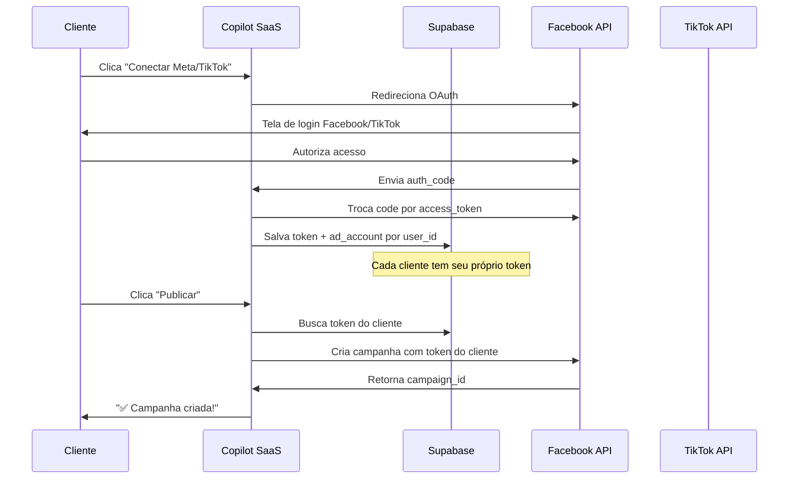

# 🔧 Guia de Configuração — Meta Ads + TikTok Ads

## Arquitetura Multiusuário



---

## 📘 PARTE 1: Configurar Meta Ads (Facebook/Instagram)

### Passo 1: Criar App no Facebook Developers

1. Acesse [developers.facebook.com](https://developers.facebook.com/)
2. Clique em **"Meus Apps"** → **"Criar App"**
3. Escolha o tipo **"Business"** (Negócios)
4. Dê um nome: `Copilot Marketing SaaS`
5. Após criar, anote:
   - **App ID** → coloque no `.env` como `META_APP_ID`
   - **App Secret** (em Configurações → Básico) → coloque como `META_APP_SECRET`

### Passo 2: Configurar OAuth

1. No painel do app, vá em **Produtos** → **Facebook Login** → **Configurações**
2. Em **"URIs de Redirecionamento OAuth Válidos"**, adicione:
   ```
   http://localhost:5000/auth/meta/callback
   ```
   (e o URL de produção quando tiver, ex: `https://seusite.com/auth/meta/callback`)

### Passo 3: Solicitar Permissões

Para publicar anúncios, você precisa solicitar estas permissões na aba **"Permissões e Recursos"**:

| Permissão | Para que serve |
|-----------|----------------|
| `ads_management` | Criar e gerenciar campanhas |
| `ads_read` | Ler métricas de campanhas |
| `business_management` | Acessar Business Manager |
| `pages_manage_posts` | Publicar em páginas |
| `pages_read_engagement` | Ler engajamento |

> [!WARNING]
> As permissões `ads_management` e `business_management` precisam de **revisão do Facebook**. Você vai precisar:
> - Ter uma política de privacidade publicada
> - Descrever como usa os dados
> - Tempo de aprovação: **3-7 dias úteis**
> 
> **Enquanto espera**, você pode testar com seu próprio Facebook usando a permissão de teste (sem revisão).

### Passo 4: Preencher o `.env`

```env
META_APP_ID=123456789012345
META_APP_SECRET=abcdef1234567890abcdef1234567890
META_REDIRECT_URI=http://localhost:5000/auth/meta/callback
```

### Passo 5: Testar

1. Reinicie o servidor
2. Clique em **"🔗 Conectar Meta Ads"** no sidebar
3. Faça login com seu Facebook
4. Se tudo der certo, aparece: **"✅ Meta Ads Conectado!"**
5. Gere uma campanha e clique **"🚀 Publicar no Meta Ads"**

---

## 🎵 PARTE 2: Configurar TikTok Ads

### Passo 1: Criar App no TikTok Marketing API

1. Acesse [ads.tiktok.com/marketing_api](https://ads.tiktok.com/marketing_api/)
2. Clique em **"My Apps"** → **"Create App"**
3. Preencha:
   - **App Name**: `Copilot Marketing SaaS`
   - **Description**: Ferramenta de automação de marketing com IA
4. Após criar, anote:
   - **App ID** → coloque no `.env` como `TIKTOK_APP_ID`
   - **App Secret** → coloque como `TIKTOK_APP_SECRET`

### Passo 2: Configurar OAuth

1. No painel do app, vá em **"App Management"**
2. Em **Redirect URL**, adicione:
   ```
   http://localhost:5000/auth/tiktok/callback
   ```

### Passo 3: Solicitar Permissões (Scopes)

| Permissão | Para que serve |
|-----------|----------------|
| `campaign.create` | Criar campanhas |
| `ad.create` | Criar anúncios |
| `file.video.create` | Upload de vídeos |
| `reporting.read` | Ler métricas |

> [!TIP]
> O TikTok tem um **modo Sandbox** que permite testar tudo sem gastar dinheiro real! Recomendo ativar o sandbox primeiro.

### Passo 4: Preencher o `.env`

```env
TIKTOK_APP_ID=7381234567890123
TIKTOK_APP_SECRET=abcdef1234567890abcdef1234567890
TIKTOK_REDIRECT_URI=http://localhost:5000/auth/tiktok/callback
```

### Passo 5: Testar

1. Reinicie o servidor
2. Clique em **"🎵 Conectar TikTok Ads"** no sidebar
3. Faça login com seu TikTok Business
4. Se tudo der certo, aparece: **"✅ TikTok Ads Conectado!"**
5. Gere uma campanha com vídeo e clique **"🎵 Publicar no TikTok Ads"**

---

## 📋 PARTE 3: Rodar o SQL no Supabase

Abra o **SQL Editor** no Supabase e cole **todo** o conteúdo do arquivo [setup_supabase.sql](file:///c:/Users/denio/Documents/Denio/MKT/setup_supabase.sql).

Isso vai criar a nova tabela `user_tiktok_tokens` e garantir que o RLS está desativado.

> [!IMPORTANT]
> Se as tabelas já existem, o `CREATE TABLE IF NOT EXISTS` vai ignorar silenciosamente. Não vai apagar dados existentes.

---

## 📊 Status Final do Sistema

| Módulo | Status | Detalhes |
|--------|--------|----------|
| ✨ Geração de Texto | ✅ 100% | Llama 3 70B + revisão GPT-3.5 |
| 🖼️ Geração de Imagens | ✅ 100% | SiliconFlow → Replicate → Placeholder |
| 🎬 Geração de Vídeo | ✅ 100% | Wan 2.2 T2V Fast (Replicate) |
| 💾 Banco de Dados | ✅ 100% | Supabase com service_role |
| 🔗 Meta OAuth | ✅ Pronto | Falta `META_APP_ID` |
| 🚀 Meta Publicação | ✅ Pronto | Cria campanha real via Graph API |
| 🎵 TikTok OAuth | ✅ Pronto | Falta `TIKTOK_APP_ID` |
| 📤 TikTok Upload+Publicação | ✅ Pronto | Upload vídeo + cria campanha |
| 🧠 Eva Brain (Análise) | ✅ Funcional | MiniMax de alto contexto |
| 📚 Histórico | ✅ Funcional | Auto-load ao mudar de aba |
